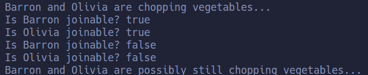

# Homework: Reuse past homework and

- `Students:` 
  - Mondalgo Tapia, Juan Carlos.
  - Pineda Silupu, Kevin Jair.
- `Course:` Parallel Programming
- `University:` UNMSM.


## Task reuse:
Two threads chopping vegetables


This C++ code implements a basic example of parallel programming using threads (std::thread). The program simulates two individuals, Olivia and Barron, chopping vegetables concurrently.

```c++
/**
 * Two threads chopping vegetables
 */
#include <thread>
#include <chrono>

bool chopping = true;

void vegetable_chopper(const char* name) {
    unsigned int vegetable_count = 0;
    while (chopping) {
        vegetable_count++;
    }
    printf("%s chopped %u vegetables.\n", name, vegetable_count);
}

int main() {
    std::thread olivia(vegetable_chopper, "Olivia");
    std::thread barron(vegetable_chopper, "Barron");
   
    printf("Barron and Olivia are chopping vegetables...\n");
    std::this_thread::sleep_for(std::chrono::seconds(1));
    chopping = false;
    barron.join();
    olivia.join();
}
```

# Solution
The solution is **here**
```c++
#include <thread>
#include <chrono>
#include <cstdio>

// Global variable to control the chopping loop in vegetable_chopper function
bool chopping = true;

// Function representing the vegetable chopping task for each worker
void vegetable_chopper(const char* name) {
    unsigned int vegetable_count = 0;
    // Continue chopping vegetables until chopping is set to false
    while (chopping) {
        vegetable_count++;
    }
    // Print the number of vegetables chopped by the worker
    printf("%s chopped %u vegetables.\n", name, vegetable_count);
    // Sleep for 10 seconds to simulate additional work after chopping
    std::this_thread::sleep_for(std::chrono::seconds(10));
}

int main() {
    // Create two threads, Olivia and Barron, to perform vegetable chopping
    std::thread olivia(vegetable_chopper, "Olivia");
    std::thread barron(vegetable_chopper, "Barron");
   
    // Print a message indicating that Barron and Olivia are chopping vegetables
    printf("Barron and Olivia are chopping vegetables...\n");

    // Check if threads are joinable before calling join()
    printf("Is Barron joinable? %s\n", barron.joinable() ? "true" : "false");
    printf("Is Olivia joinable? %s\n", olivia.joinable() ? "true" : "false");

    // Detach threads, allowing them to continue execution independently
    barron.detach();
    olivia.detach();

    // Print whether threads are joinable after detachment
    printf("Is Barron joinable? %s\n", barron.joinable() ? "true" : "false");
    printf("Is Olivia joinable? %s\n", olivia.joinable() ? "true" : "false");

    // Allow threads to continue running in the background

    // To give detached threads time to execute the vegetable_chopper function
    printf("Barron and Olivia are possibly still chopping vegetables...\n");
    
    // Note: Threads are still running, but the main program may terminate

    return 0;
}

```


### Show schedule effects

#### Console output


Barron and Olivia are chopping vegetables...:

This message is printed from the main function, indicating that both threads (Barron and Olivia) are actively running the vegetable_chopper function.
Is Barron joinable? true:

This line checks if the thread Barron is joinable before any detach or join operations. Since neither detach nor join has been called on Barron yet, it is joinable.
Is Olivia joinable? true:

Similar to the case of Barron, this line checks if the thread Olivia is joinable before any detach or join operations. Both threads are joinable at this point.
Is Barron joinable? false:

After calling barron.detach(), the thread Barron is detached from the thread object, and it becomes non-joinable. This is why the result is false.
Is Olivia joinable? false:

Similarly, after calling olivia.detach(), the thread Olivia is detached, making it non-joinable. Hence, the result is false.
Barron and Olivia are possibly still chopping vegetables...:

This message is printed after detaching the threads, indicating that the main program is allowing the detached threads to continue running in the background.


### show or add functions for:

#### Join:

join blocks the calling thread until the associated thread finishes its execution.
It is used to synchronize the main thread with the completion of the associated thread.

#### Joinable:

joinable checks if the thread object is associated with a thread of execution.
It is often used to determine whether it's safe to call join or detach on a thread.
#### Detach:

detach separates the thread of execution from the thread object.
The detached thread can continue to execute independently, and its resources are automatically released when it finishes.
After detaching, the thread object is no longer associated with any thread of execution.

- join
  
  ```c++
    barron.join();
    olivia.join();
  ```

- joinable

  ```c++
    printf("Is Barron joinable? %s\n", barron.joinable() ? "true" : "false");
    printf("Is Olivia joinable? %s\n", olivia.joinable() ? "true" : "false");
  ```
- detach
   
  The `detach` function in C++ is used to release a thread from dependency on the main thread, allowing it to `continue execution` `independently`.
   

  ```c++
    barron.detach();
    olivia.detach();
  ```


